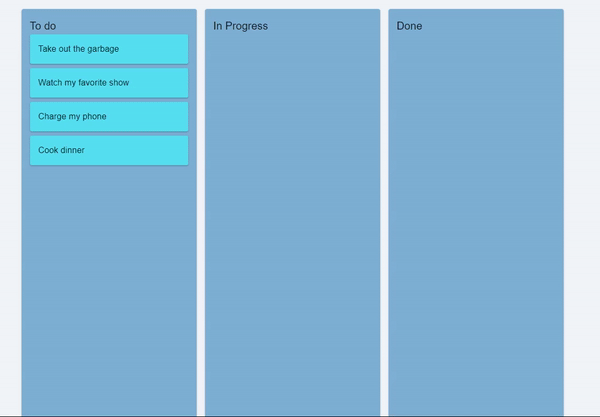

# Project Management Board

A Trello-like project management board built with React and drag-and-drop functionality using the `@dnd-kit` library.



## Features

- Drag and drop tasks within and between columns.

## Prerequisites

- Node.js and npm (or yarn) installed on your machine.

## Getting Started

### Clone the repository

```sh
git clone https://github.com/Ali-Noghabi/project-managment.git
cd project-management
```

### Install dependencies

```sh
npm install
```

or if you prefer using yarn:

```sh
yarn install
```

### Running the Project

#### On Windows

1. Open a terminal (Command Prompt, PowerShell, or Git Bash).
2. Navigate to the project directory.
3. Run the development server:

```sh
npm start
```

or

```sh
yarn start
```

4. Open your browser and go to `http://localhost:3000`.

#### On Linux

1. Open a terminal.
2. Navigate to the project directory.
3. Run the development server:

```sh
npm start
```

or

```sh
yarn start
```

4. Open your browser and go to `http://localhost:3000`.

### Project Structure

```
project-management-board/
├── node_modules/
├── public/
│   ├── index.html
│   └── ...
├── src/
│   ├── components/
│   │   ├── Board.js
│   │   ├── Card.js
│   │   ├── Column.js
│   │   ├── Board.css
│   │   ├── Card.css
│   │   └── Column.css
│   ├── index.js
│   ├── App.js
│   ├── index.css
│   └── ...
├── .gitignore
├── package.json
├── README.md
└── ...
```

### How to Use

- To move a task, click and drag it to the desired position within the same column or to a different column.
- Add more tasks or columns by modifying the initial data in `src/components/Board.js`.

### Contributing

Feel free to fork this repository and submit pull requests. Any improvements or bug fixes are welcome!
